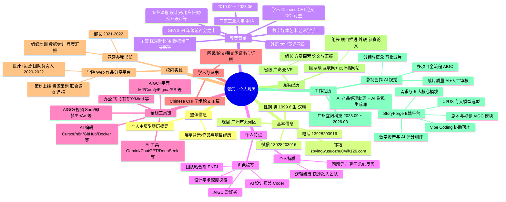

# 张滨 · 个人履历思维导图

与「根节点—一级主题—子节点」结构一致的可视化大纲；可在支持 Mermaid 的编辑器中预览。

---

## 纯文本大纲（无 Mermaid 时可读）

- **张滨 · 个人履历**
  - **整体信息：** 个人主页型履历；概括背景与项目，便于快速了解
  - **基本信息：** 电话 / 微信 / 邮箱 / 现居城市 / 性别 / 出生年月 / 民族
  - **教育背景：** 广工数字媒体艺术本科、GPA、课程荣誉、Chinese CHI、四级
  - **个人特点：** AIGC 与 AI 设计、coder、学术、团队、ENTJ；特质与协作方式
  - **全线工具链：** AI 工具、编辑与协作、平面/视频 AIGC、办公软件
  - **学术与证书：** 论文、外语与荣誉类证明
  - **校内实践：** Web 平台负责人、党建办秘书部
  - **竞赛经历：** 「设计酱」网站、「广彩瓷」VR；组长与论文产出
  - **工作经历：** 宜阅科技；StoryForge 产品与 AI 影视视觉全流程
